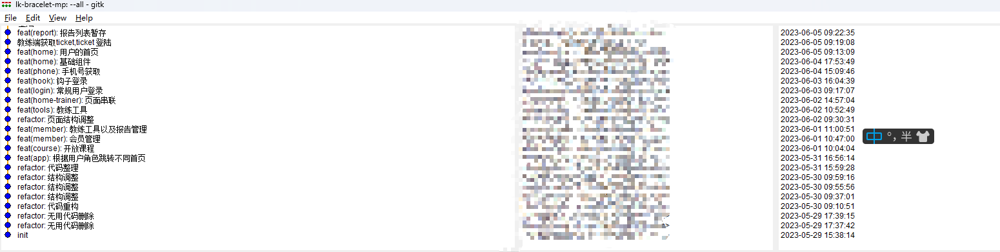
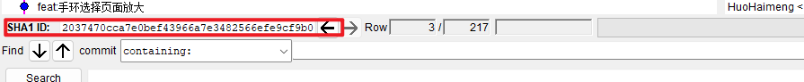

# gitk

使用 `gitk` 打开 `git` 的图形操作界面

这将打开 Git 图形化界面，显示当前 Git 仓库的提交历史和分支信息。在 gitk 界面中，可以使用鼠标点击不同的提交节点，查看提交的详细信息。
以下是一些常用的 gitk 参数：

```sh
-all：显示所有分支的提交历史。
--since=<date>：只显示指定日期之后的提交记录。
--until=<date>：只显示指定日期之前的提交记录。
--author=<pattern>：只显示符合指定作者名称模式的提交记录。
--branches=<glob>：只显示符合指定分支名称模式的提交记录。
--tags=<glob>：只显示符合指定标签名称模式的提交记录。
--remotes=<glob>：只显示符合指定远程分支名称模式的提交记录。
--not=<ref>：排除指定的分支或标签。
--date-order：按照日期顺序显示提交记录。
--reverse：反转提交记录的顺序。
--no-walk：只显示当前分支的提交历史。
```

例如，以下命令将显示所有分支的提交历史：
gitk --all

以下命令将只显示当前分支中最近一个月的提交记录：
gitk --since="1 month ago"
可以使用 gitk --help 命令查看所有可用的参数以及它们的用途。



点击 某一条在下面能看到 sha1 也就是我们会用到的 commitid


