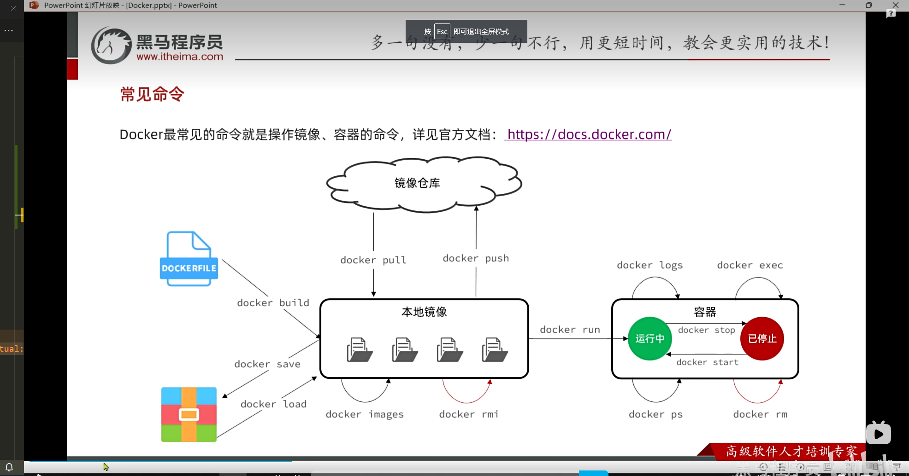

# docker

## 信息记录
>
> 1. portainer 的账号和密码
>     admin aiwen19950203

## 命令

```shell
docker run -d 
    --name mysql
    --p 3306:3306
    --e MYSQL_ROOT_PASSWORD 123 
```

1. docker pull
2. docker build
3. docker save
4. docker load
5. docker run 创建并运行
6. docker stop
7. docker start
8. docker restart
9. docker ps
10. docker rm

镜像 命名规范


## 镜像 和 容器

当我们利用 Docker 安装应用时，Docker 会自动搜索并下载应用镜像(image), 镜像 不仅包含应用本身, 还包含运行所需要的环境、配置、系统函数库。 Docker 会在运行镜像的时候创建一个隔离环境，称为容器。

## 数据卷

```sh
docker run -d \
--name ngnix \
-p 80:80 \
-v html:/usr/share/nginx/html \
nginx
```

## 自定义镜像

## 网络

Docker 主要是在操作镜像和容器

## 安装 portainer  docker 的 镜像管理的 UI 界面

```sh
docker volume create portainer_data

```
